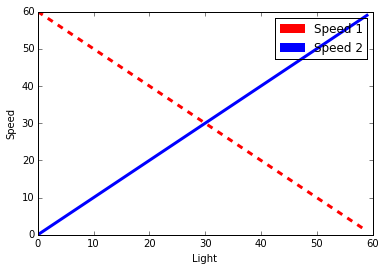

Wednesday
=========

Gregor plans to be at school at 6:00pm

During that time I will be working with anyone that is there to teach about programming. 
This session is for beginners and those that like to get a refresher in programming.
  
We will discuss the following:
  
Part I: Variables and Files
---------------------------

* [ ] how to use variables
* [ ] how to use files
* [ ] how to use files and variables
  
Part II: Going Straight 
------------------------

* [ ] Math: How to get the distance from a wheel wher we know circumferance and diameter

  * [ ] How to measure the diameter of a wheel 
  * [ ] How to measure the circumference of a wheel with a string
  * [ ] How to read the diameter od a whele from the lego tires
  
* [ ] Math: C/d = pi
  
  * [ ] Experiment 1: We will measure the circumferenace and diameter and calculate C/d
  * [ ] Experiment 2: We will compare the different ratios for the different wheel sizes
  * [ ] Experiment 3: We will recalculate the distance by C/pi = d
  * [ ] Review: We will be watching https://en.wikipedia.org/wiki/Circumference
  
* [ ] Basic program
 
  *  [ ] Organizing programs
  
    * [ ] Naming: 
    
      * [ ] variable names lower case  
      * [ ] program names: __pForward__
      * [ ] test programs: __tForward__ (copy __pForward__)
      * [ ] __IMPORTANT__: myBlocks: __mForward__ (only use __tForward__ if something is wrong with myblock, delete __tforward__ and start from __pForward__)
      
        * Reasoning: if you make a definition error in myBlocks they can not be reversed, and you have to start over. For big programs this is a problem. Afoid that you spend hours of recreating the big program.

  * [ ] Write a basic program using the above while using the variables __distance__, __speed__, __circumferance__
  * [ ] Write a __myBlock__ that has the following inputs inputs __distance__, __speed__, __circumferance__. Set proper default sfor the vakues. distance = 10cm, speed=40, circumference = the one you found for your wheel in the math section
  
    * We write such a program abbreviated as __mForward(distance, speed, circumferenace)__
 
  * [ ] Test your robot with the new program
  
* [ ] Creating a Library for moving

  * [ ] __mForward(distance, speed, circumferenace)__
  * 
  
Turning
--------

Write a programsthat turns your robot on the spot.

  * [ ] __mTurnLeft, mTurnRight(speed)__
  * [ ] __mTurnLeft45, mTurnRight45(speed)__
  * [ ] __mTurnLeft30, mTUrnRigt30(speed)__

  * [ ] __mTurnDegree(degree, speed)__

  * [ ] Test yor program while turning a full rotation with your dergee algorithm. Example: 45 degrees turn 8 times

Line Following Program

  * [ ] Edication of line following. Simple algorithm
  * [ ] Impact of speed 
  * [ ] Table 
  * 
  
No need to understand this, but the two lines

black = 10
white = 70
f_rotate = 1.0
s1=[]
s2=[]

print "            light     speed1     speed2"
for i in range(black,white):
    light = float(i)
    
    speed1 = (white-light) * f_rotate  # THIS IS IMPORTANT
    speed2 = (light-black) * f_rotate  # THIS IS IMPORTANT
            
    print "{:6d} {:10.2f} {:10.2f} {:10.2f} ".format(i, light, speed1, speed2)
    s1.append(speed1)
    s2.append(speed2)
    
           light     speed1     speed2
    10      10.00      60.00       0.00 
    11      11.00      59.00       1.00 
    12      12.00      58.00       2.00 
    13      13.00      57.00       3.00 
    14      14.00      56.00       4.00 
    15      15.00      55.00       5.00 
    16      16.00      54.00       6.00 
    17      17.00      53.00       7.00 
    18      18.00      52.00       8.00 
    19      19.00      51.00       9.00 
    20      20.00      50.00      10.00 
    21      21.00      49.00      11.00 
    22      22.00      48.00      12.00 
    23      23.00      47.00      13.00 
    24      24.00      46.00      14.00 
    25      25.00      45.00      15.00 
    26      26.00      44.00      16.00 
    27      27.00      43.00      17.00 
    28      28.00      42.00      18.00 
    29      29.00      41.00      19.00 
    30      30.00      40.00      20.00 
    31      31.00      39.00      21.00 
    32      32.00      38.00      22.00 
    33      33.00      37.00      23.00 
    34      34.00      36.00      24.00 
    35      35.00      35.00      25.00 
    36      36.00      34.00      26.00 
    37      37.00      33.00      27.00 
    38      38.00      32.00      28.00 
    39      39.00      31.00      29.00 
    40      40.00      30.00      30.00 
    41      41.00      29.00      31.00 
    42      42.00      28.00      32.00 
    43      43.00      27.00      33.00 
    44      44.00      26.00      34.00 
    45      45.00      25.00      35.00 
    46      46.00      24.00      36.00 
    47      47.00      23.00      37.00 
    48      48.00      22.00      38.00 
    49      49.00      21.00      39.00 
    50      50.00      20.00      40.00 
    51      51.00      19.00      41.00 
    52      52.00      18.00      42.00 
    53      53.00      17.00      43.00 
    54      54.00      16.00      44.00 
    55      55.00      15.00      45.00 
    56      56.00      14.00      46.00 
    57      57.00      13.00      47.00 
    58      58.00      12.00      48.00 
    59      59.00      11.00      49.00 
    60      60.00      10.00      50.00 
    61      61.00       9.00      51.00 
    62      62.00       8.00      52.00 
    63      63.00       7.00      53.00 
    64      64.00       6.00      54.00 
    65      65.00       5.00      55.00 
    66      66.00       4.00      56.00 
    67      67.00       3.00      57.00 
    68      68.00       2.00      58.00 
    69      69.00       1.00      59.00 
    
    

  
        
        
        
        
  
